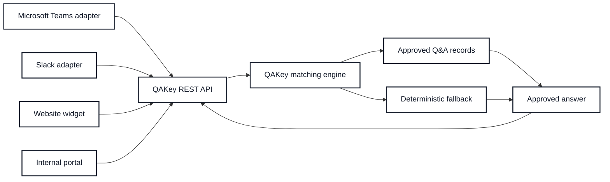

# Future Enhancements

- Add a functional scaffold for feedback alerts to be delivered to the editor’s email as a periodic digest.

## Maintainer Alert System

### Concept

QAKey may eventually support email alerts or digest notifications when review-worthy events accumulate. These events could include unmatched questions, low-confidence matches, ambiguous matches, user feedback, and stale records needing review.

The purpose is to support maintainers who do not check the editor every day. Rather than silently collecting unresolved feedback, QAKey can notify the configured maintainer that content may need review. Alerts should be digest-based by default to avoid noise and should direct maintainers back to the review queue in the editor.

This supports QAKey’s accessibility principle: keeping approved answers current should not depend on a maintainer remembering to manually inspect the system.

Example digest summary:

- QAKey has 7 items that may need review:
  - 3 unanswered questions
  - 2 low-confidence matches
  - 1 ambiguous match pattern
  - 1 user feedback comment

### Initial Alert Trigger Event Types

- `no_match`
- `low_confidence`
- `ambiguous_match`
- `negative_feedback`
- `stale_review`

Each event type maps to a maintainer task:

| Event | Meaning | Maintainer action |
|---|---|---|
| `no_match` | QAKey could not find an approved answer | Add a new Q&A pair or synonym |
| `low_confidence` | QAKey answered, but barely passed threshold | Add alternate phrasing or improve canonical question |
| `ambiguous_match` | Multiple records were too close | Clarify records or add “do not match” guidance later |
| `negative_feedback` | User marked answer unhelpful | Review answer wording or matching |
| `stale_review` | Record is past review date | Confirm answer is still current |

---

## Teams App and Adapter Framework

QAKey may eventually support adapter-based deployment so the same approved Q&A knowledge base can be exposed through multiple user interfaces, including Microsoft Teams, Slack, web widgets, intranet portals, and other chat or support surfaces.

The core QAKey engine should remain channel-agnostic. Matching, fallback behavior, approved answer delivery, confidence scoring, and source-of-truth management should live in the QAKey framework itself. Adapters should only translate between a specific platform and QAKey’s query API.

For example, a Microsoft Teams adapter could allow users to ask questions within Teams while QAKey continues to resolve them against Active approved records. The Teams app would send the user’s question to QAKey, receive either a matched approved answer or a deterministic fallback response, and display that response in the Teams conversation.

A Teams implementation could support:

* one-to-one chat with the QAKey bot;
* channel-based use for shared team questions;
* adaptive-card responses for matched answers, fallback messages, and suggestions;
* links back to source documents, policies, or the QAKey editor where appropriate;
* role-aware access if connected to organizational authentication;
* feedback buttons such as “Helpful,” “Not helpful,” or “Needs review.”

Other adapters could follow the same pattern. Slack, website widgets, intranet search boxes, and internal assistant tools should all call the same QAKey API rather than creating separate logic for each channel.

The intended architecture is:

```text
User interface or platform adapter
        ↓
QAKey REST API
        ↓
QAKey matching engine
        ↓
Approved Q&A records
        ↓
Matched answer or deterministic fallback
```

This preserves QAKey’s central contract: the delivery channel may change, but the answer behavior remains controlled, deterministic, and governed by the approved source of truth.

Adapters should be treated as extensions rather than requirements. A small organization may need only the local web UI, while a larger organization may choose to expose QAKey through Teams, Slack, an internal portal, or multiple channels simultaneously. Adapters should change where QAKey appears, not how QAKey answers.




    
