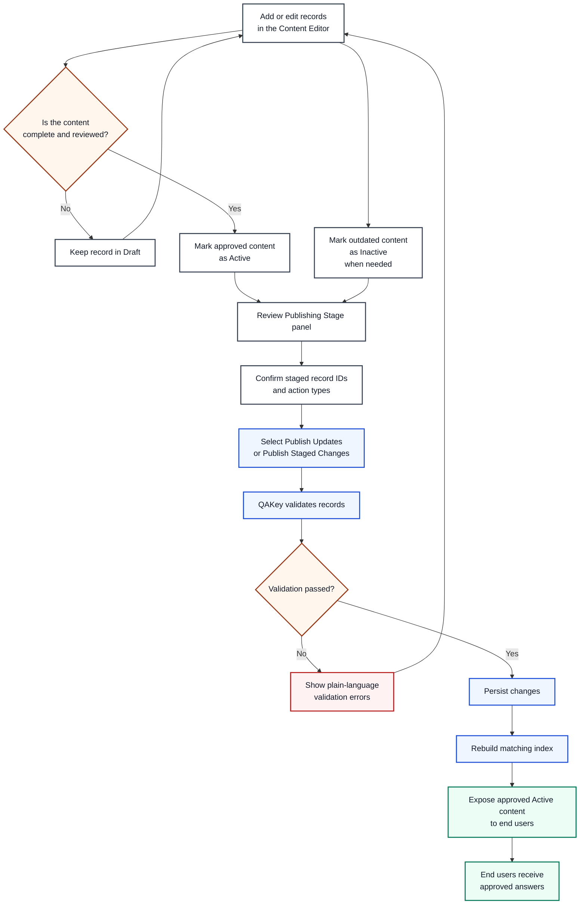

# QAKey Source-of-Truth Framework

## Start here

QAKey is designed to let maintainers manage approved answers without needing coding, repository, or data-format knowledge.
The editor should feel as familiar as updating a spreadsheet while the system preserves the structure and control required for deterministic question answering.

---

## Core intent

QAKey provides a spreadsheet-like content editor designed for maintainers who do not need coding, repository, or data-format knowledge.
Maintainers can add a canonical question, enter its approved answer, set the record to `Draft`, `Active`, or `Inactive`, and identify themselves as the contributor or reviewer.

Dates, record identifiers, validation, versioning, and runtime conversion are handled automatically by QAKey.
When the maintainer selects **Publish Updates**, QAKey validates the content, updates the structured source of truth, rebuilds the question-matching index, and makes approved changes available in the application.

The goal is to make content maintenance as familiar as editing a spreadsheet while preserving the structure, auditability, and reliability required by a deterministic question-answering system.

The editor is intentionally separate from the user-facing query page.
When enabled, editor access can be bounded behind an admin/password gate as a baseline, with room to adopt organization security layers later.

---

## What maintainers control

Maintainers are responsible for the content fields that define the approved answer set:

- Canonical question
- Approved answer
- Status: `Draft`, `Active`, or `Inactive`
- Contributor identity
- Reviewer identity
- Optional alternates, tags, and imported source text

This keeps subject matter ownership with the people who know the policy or process best.

## What QAKey handles automatically

QAKey handles the operational details that maintainers should not need to manage manually:

- Record identifiers
- Created and updated timestamps
- Validation before publish
- Version increments on change
- Structured persistence to the source-of-truth store
- Rebuild of the deterministic matching index
- Runtime rendering of approved answers in the application

This split is deliberate: people own the meaning, and the system owns the mechanics.

---

## Publish workflow

The intended maintainer workflow is:

1. Add or edit records in the content editor.
2. Keep incomplete or unreviewed content in `Draft`.
3. Mark approved content as `Active`.
4. Use `Inactive` for content that should remain in the record history but no longer answers user questions.
5. Review the Publishing Stage panel, including staged record IDs and action types.
6. Select **Publish Updates** (or **Publish Staged Changes**).
7. Let QAKey validate records, persist changes, rebuild the index, and expose approved content to end users.

This keeps publishing explicit, reviewable changes rather than silently mutating live answers.

---

## Why this model matters

This framework exists to preserve three things at once:

- Familiar editing for non-developers
- Auditability for teams that need to know what changed and who changed it
- Deterministic answer delivery so the application returns the approved answer exactly as maintained

QAKey is not trying to turn maintainers into developers.
It is trying to give them a safe, legible source-of-truth workflow for high-confidence answers.
